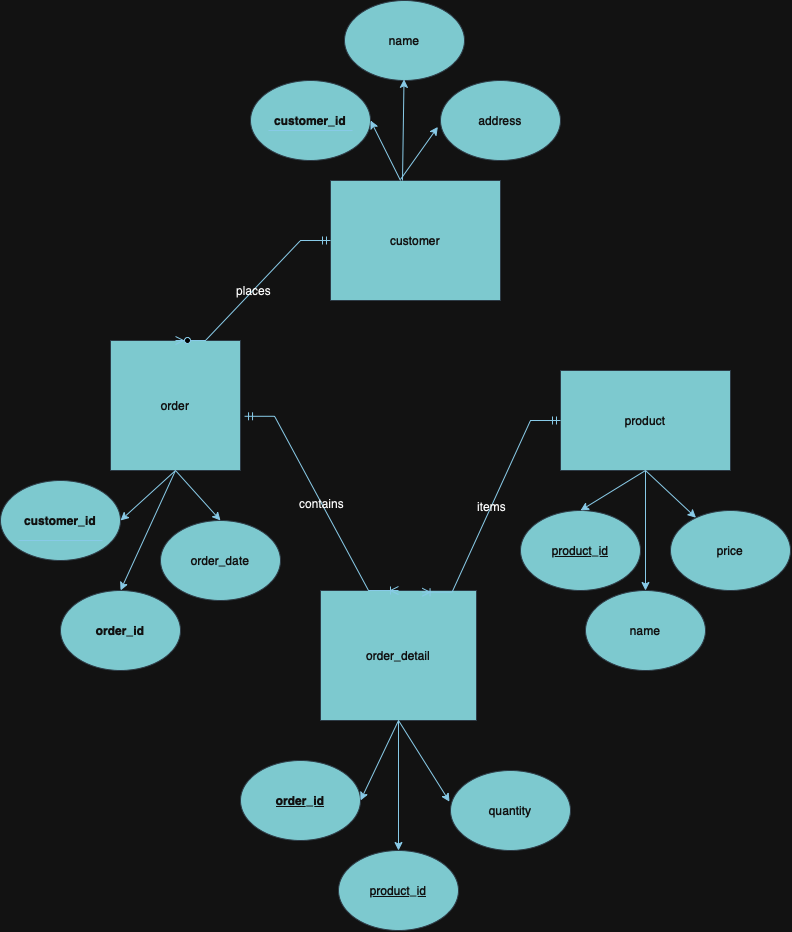

# SQL task


## Task 1: Question


Create table and insert data

```
CREATE TABLE IF NOT EXISTS unlabeled_image_predictions (
image_id int, score float
);
INSERT INTO unlabeled_image_predictions (image_id, score) VALUES
('828', '0.3149' ), ('705', '0.9892'), ('46', '0.5616'), ('594', '0.7670'), ('232', '0.1598'), ('524', '0.9876'), ('306', '0.6487'),
('132', '0.8823'), ('906', '0.8394'), ('272', '0.97789'), ('616', '0.1003'), ('161', '0.7113'), ('715', '0.8921'), ('109', '0.1151'),
('424', '0.7790'), ('609', '0.5241'), ('63', '0.2552'), ('276', '0.2672'), ('701', '0.0758 '), ('554', '0.4418 '), ('998', '0.0379'),
('809', '0.1058'), ('219', '0.7143'), ('402', '0.7655'), ('3631', '0.2661'), ('624', '0.8270 '), ('6401', '0.8790'), ('913', '0.2421'),
('439', '0.3387'), ('464', '0.3674'), ('405', '0.6929'), ('986', '0.8931'), ('344', '0.3761'), ('847', '0.4889'), ('482', '0.5023'),
('823', '0.3361'), ('617', '0.0218'), ('47', '0.0072'), ('867', '0.4050'), ('96', '0.4498'), ('126', '0.3564'), ('9431', '0.0452'),
('115', '0.5309'), ('417', '0.7168'), ('706', '0.9649' ), ('166', '0.2507'), ('991', '0.4191'), ('465', '0.0895'), ('53', '0.8169'),
('971', '0.9871');
```

SS:


- Query 1:

```
SELECT t.image_id, 0 as weak_id
FROM
(
    SELECT image_id, score, ROW_NUMBER() OVER (ORDER BY score desc) AS rownum
    FROM unlabeled_image_predictions
) AS t	
WHERE t.rownum % 3 = 0   and rownum < 3334 and score < 0.5

UNION

SELECT t.image_id, 1 as weak_id
FROM
(
    SELECT image_id, score, ROW_NUMBER() OVER (ORDER BY score desc) AS rownum
    FROM unlabeled_image_predictions 
) AS t
WHERE t.rownum % 3 = 0  and rownum < 3334 and score >= 0.5
ORDER BY t.image_id;
```

SS: 


- Query 2:

```
WITH pos_samples (image_id, score) AS (
  SELECT image_id, score
  FROM (
    SELECT image_id, score, ROW_NUMBER() OVER (ORDER BY score DESC) AS row_num
    FROM unlabeled_image_predictions
  ) AS t
  WHERE row_num % 3 = 0 and score >= 0.5
  LIMIT 3334
),
neg_samples (image_id, score) AS (
  SELECT image_id, score
  FROM (
    SELECT image_id, score, ROW_NUMBER() OVER (ORDER BY score DESC) AS row_num
    FROM unlabeled_image_predictions
  ) AS t
  WHERE row_num % 3 = 0 and score < 0.5
  LIMIT 3334
)
SELECT ps.image_id, 1 AS weak_label
FROM pos_samples ps
UNION
SELECT ns.image_id, 0 AS weak_label
FROM neg_samples ns
ORDER BY image_id;
```

SS: 


## Task 2:  Er Diagram table creation code


```
-- customer table creation
Create table customer
(
customer_id int primary key,
name varchar(50) not null,
address varchar(50) not null
);

-- product table creation 
create table product
(
product_id int primary key,
name varchar(50) not null,
price float not null
);


-- orders table creation 
create table orders
(
order_id int primary key,
order_date date not null,
customer_id  int,
foreign key (customer_id) references customer(customer_id)
);

-- order details table creation
create table order_details
(
order_id int,
product_id int,
quantity int,
Primary key (order_id,product_id),
foreign key (product_id) references product(product_id),
FOREIGN KEY (order_id) REFERENCES orders(order_id)
);
```

SS:


